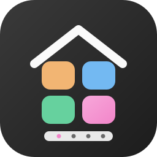
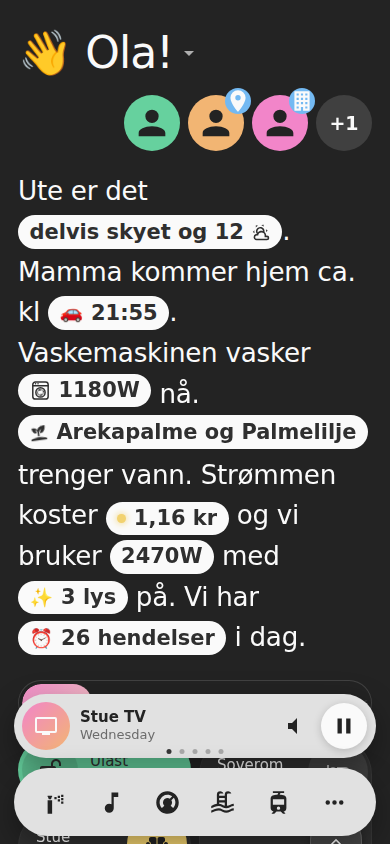
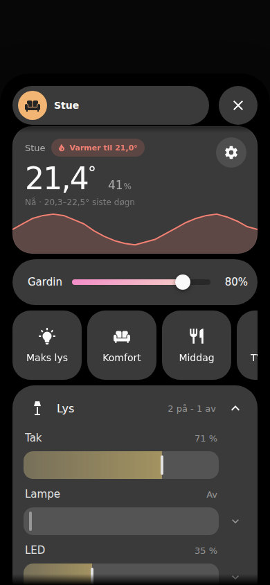
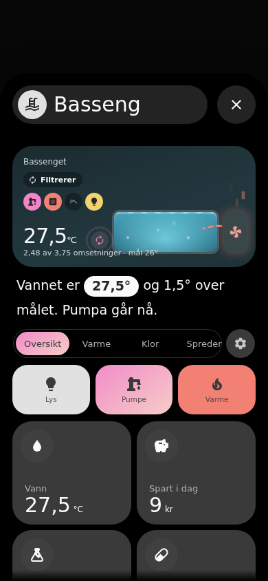
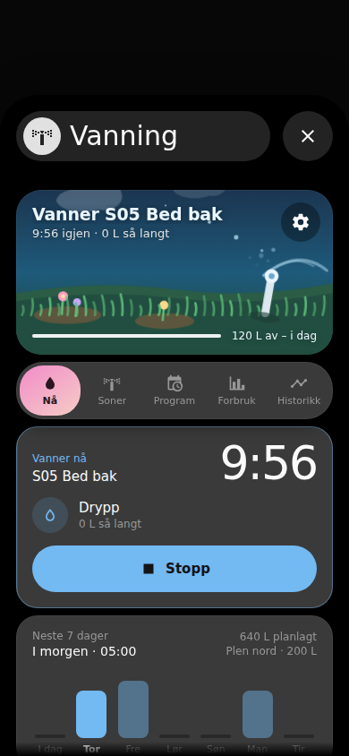
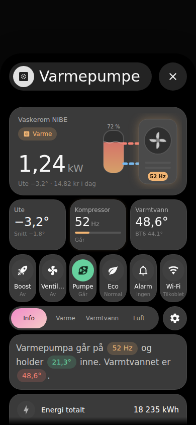
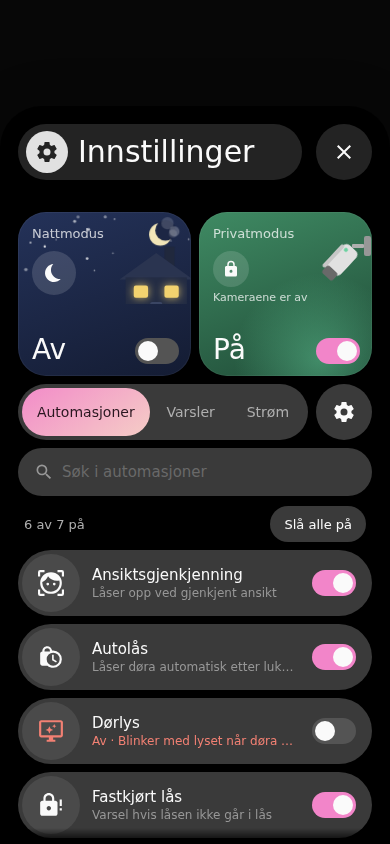
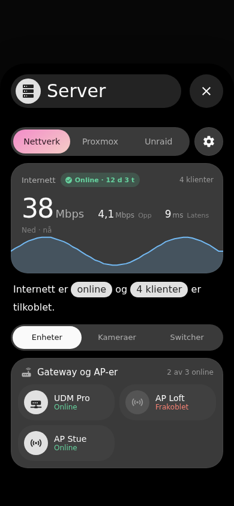
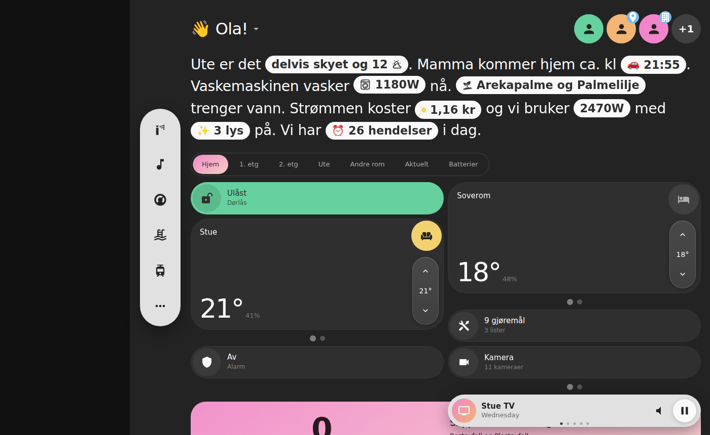

<p align="center">
  
</p>

<h1 align="center">KI MSH</h1>

<p align="center">
  My SmartHome v3-dashbordet for Home Assistant – custom cards i JavaScript, bygget for <b>Bubble Card-popups</b>.
</p>

<p align="center">
  <a href="https://hacs.xyz"></a>
  <a href="https://www.home-assistant.io"></a>
  <a href="https://github.com/SebastianKristo/ki-msh/releases"></a>
  <a href="LICENSE"></a>
</p>
Dette er basert på MySmartHome av agoberg85. All ære for designinspirasjonen går til ham.

Hele dashbordet genereres av strategien `custom:ki-dashboard`: Hjem-visning med header, prosa, faner og romkort, en navbar
(bunn på mobil, rail på PC) og én Bubble Card-popup per rom og funksjon. Alt autokonfigureres fra HA-områder, -etasjer og
-registre og [KI Rom](https://github.com/SebastianKristo/ki-rom) – ingen eksempeldata og ingen hardkodede entitets-IDer.
Det som blir feil, overstyres i kortets egen «Tilpass»-ark eller i HAs GUI-editor.

## Innhold

- [Skjermbilder](#skjermbilder)
- [Funksjoner](#funksjoner)
- [Installasjon](#installasjon)
- [Popups](#popups)
- [Tilpasning](#tilpasning)
- [Konfigurasjon av strategien](#konfigurasjon-av-strategien)
- [Utvikling](#utvikling)
- [Lisens](#lisens)

## Skjermbilder

Mobil (390 px, mørkt tema) og PC med rail-navbar. Bildene er tatt i testharnessen med testdata (ingen ekte personer,
adresser eller kameraer).

| Hjem | Rom | Basseng | Vanning |
|:---:|:---:|:---:|:---:|
|  |  |  |  |

| Varmepumpe | Innstillinger | Server |
|:---:|:---:|:---:|
|  |  |  |



## Funksjoner

- **Ett kort per popup.** Hver Bubble Card-popup har nøyaktig ett kort i `cards:`; toppkortet (klima-toppkortet i Rom,
  hero i Basseng/Klima/Media …) er første seksjon inni kortet. Bubble Card eier headeren, ikonet og lukk-knappen.
- **Autokonfig først.** Rom fra HA-områder og KI Rom (`sensor.<rom>_oversikt`, `_lys`, `_effekt` …), funksjoner fra
  integrasjonene du har. Mangler noe: kortet vises med «–» og «Velg entitet» – aldri mock-verdier.
- **Tilpass-ark** for Hjem, navbar, header, rom og hver popup. Valgene lagres per HA-bruker i `frontend/set_user_data`
  (synkes mellom enhetene dine) – ingen Lovelace-lagring, så du blir værende i popupen.
- **GUI-editor** (`getConfigElement`) for alle kort, med de samme valgene som kortets egen tilpasning.
- **Mobil, Fold, iPad og PC:** navbaren nederst på mobil og som rail til høyre for HA-sidebaren på PC; ark og overlegg
  legger seg over navbaren og holder seg innenfor dashbordflaten.
- **Haptic** på trykk (én per trykk), `touch-action` og `stopPropagation` på alt som dras, så Bubble Card ikke lukker
  popupen mens du justerer en slider.

## Installasjon

1. Installer [Bubble Card](https://github.com/Clooos/Bubble-Card) (HACS) og temaet **My SmartHome v3** (mørk).
   [KI Rom](https://github.com/SebastianKristo/ki-rom) anbefales.
2. HACS → ⋮ → *Custom repositories* → `https://github.com/SebastianKristo/ki-msh`, type **Dashboard** → last ned **KI MSH**.
   HACS legger til ressursen `/hacsfiles/ki-msh/ki-msh.js` selv.
   *Manuelt:* kopier `dist/ki-msh.js` til `/config/www/` og legg til ressursen `/local/ki-msh.js` (JavaScript-modul).
3. Innstillinger → Dashbord → *Legg til dashbord* → «Nytt dashbord fra bunnen», åpne *Rå konfigurasjon* og lim inn:

   ```yaml
   strategy:
     type: custom:ki-dashboard
   ```

   Strategien bygger Hjem, navbaren og alle popups: én rom-popup per HA-område med entiteter og en funksjons-popup for
   det du har. Nye rom og integrasjoner dukker opp av seg selv. Vil du skrive YAML selv, se
   [`examples/dashboard.yaml`](examples/dashboard.yaml).

Krever Home Assistant **2024.11** eller nyere (kortene bruker `getGridOptions`). Kortene heter `msh-…`, så de kan lastes
sammen med [ki-cards](https://github.com/SebastianKristo/ki-cards).

### Oppdatering og cache

Viser HA fortsatt en gammel popup (f.eks. den gamle Basseng-popupen med `ki-basseng-card`) etter en oppdatering, er det
nesten alltid en gammel kopi av `ki-msh.js` i cachen:

1. **Bump versjonen i ressurs-URL-en.** Innstillinger → Dashbord → ⋮ → *Ressurser*: sett `?v=<versjon>` bak filen,
   f.eks. `/local/ki-msh.js?v=1.3.0` (versjonen står i `package.json` og i konsollen: «KI MSH 1.3.0»). HACS legger selv
   til `?hacstag=…` ved hver oppdatering – da trengs bare punkt 2.
2. **Tøm cachen.** Nettleser: hard omlasting (Ctrl/Cmd + Shift + R) eller «Tøm buffer og hard omlasting» i
   utviklerverktøyet (Application → Service workers → *Unregister* hvis det fortsatt er gammelt). Companion-appen:
   Innstillinger → Companion-app → *Feilsøking* → **Tilbakestill frontend-hurtigbuffer**, og lukk appen helt.
3. Sjekk konsollen: står det `[ki-msh] Ressurs-URL-en har ?v=…, men bundelen er …` eller `To versjoner er lastet`,
   bruker nettleseren/appen fortsatt en gammel kopi, eller den gamle ressursen ligger igjen i listen – fjern den.

**Basseng – `#basseng` genereres igjen (Fiks 42 Del C):** strategien lager funksjons-popupen `#basseng` (mal A, ett
`msh-basseng-card`) når den finner et basseng: et område med navn/alias som matcher `basseng|pool|svømmebasseng|boblebad|
spa|jacuzzi` (ikke «spisestue»/«nordpool»), entiteter eller enheter med samme mønster i navnet, en kjent bassengintegrasjon
(`pentair`, `intellicenter`, `screenlogic`, `omnilogic`, `iaqualink`, `hayward`, `fluidra`, `astralpool`, `poolsense`,
`ondilo_ico`, `flipr`, `blueriiot`, `zodiac`) eller en pH-/ORP-sensor (`device_class: ph` / enhet mV). I «Tilpass Hjem» →
Popups står *Basseng* alltid i lista med av/på (ki-store `popups.basseng.enabled`, ingen rebuild): på uten treff gir
popupen med «–» og «Velg entiteter», av fjerner den. Konsollen viser per generering hvilke popups som ble laget og
hvorfor andre ble hoppet over (`[ki] popups`). Den gamle engangsmigreringen som slettet bassengpopups og -lenker fra
ki-store (`migrations.basseng_fjernet`) kjører ikke lenger. Gamle importerte bassengpopups med `ki-basseng-card` droppes
fortsatt (den genererte `#basseng` tar over); står `custom:ki-basseng-card`/`custom:ki-basseng-hero-card` i et manuelt
dashbord, rendres de som `msh-basseng-card` med en advarsel i konsollen.

Det kortkoden **ikke** kan gjøre selv, og som må gjøres for hånd etter oppdateringen:
- Sett `?v=<ny versjon>` på `ki-msh.js`-ressursen (punkt 1 over) – URL-en ligger i HA, ikke i bundelen.
- Ligger de gamle `ki-basseng-card.js`/`ki-basseng-hero-card.js` fortsatt i ressurslisten: fjern dem selv.
- iOS-appen (WKWebView) holder på den gamle `ki-msh.js` til appen er tvunget til å lukke: tilbakestill frontend-hurtigbufferen
  (punkt 2), sveip appen helt bort og åpne den igjen. Sjekk så at konsollen viser riktig versjon.
- Et eget YAML-dashbord uten strategien: bytt kortene i en gammel bassengpopup til én `custom:msh-basseng-card` (se Manuelt
  under).

## Popups

Alle popups er Bubble Card `pop-up` og åpnes med hashen (f.eks. `#vanning`). Kortnavnene er de som registreres med
`customElements.define`.

| Popup | Hash | Kort | Kilde (autokonfig) |
|---|---|---|---|
| Hjem | – | `msh-hjem-card` (+ `msh-hjem-header-card`, `msh-prosa-card`, `msh-hjem-faner-card`, `msh-soppel-card`, `msh-strompris-card`, `msh-hjem-gjoremal-card`) | personer, vær, strøm, kalendere, gjøremål |
| Navbar | – | `msh-navbar-card` | funksjons-popupene som finnes |
| Rom | `#<område>` | `msh-rom-card` | KI Rom / entiteter i området |
| Person | `#person-<id>` | `msh-person-card` | `person.*`, mobil-sensorer |
| Innstillinger | `#settings` | `msh-innstillinger-card` | KI Varslinger og sikkerhet, `ki_energi` |
| Vanning | `#vanning` | `msh-vanning-card` | OpenSprinkler, `valve.*`, KI Vanning |
| Varmepumpe | `#varmepumpe` | `msh-varmepumpe-card` | NIBE (`nibe_heatpump` / myUplink) |
| Server | `#server` | `msh-server-card` | UniFi, UniFi Protect, Proxmox VE, Unraid |
| Klima | `#klima` | `msh-klima-card` | `climate.*`, `fan.*`, effekt og pris |
| Lys | `#lys` | `msh-lys-card` | `light.*` per etasje/område |
| Media | `#media` | `msh-media-card` | `media_player.*` |
| Kamera | `#kamera` | `msh-kamera-card` | `camera.*` (+ Frigate-hendelser) |
| Sikkerhet | `#sikkerhet` | `msh-sikkerhet-card` | alarm, låser, dør/vindu/bevegelse |
| Dørlås | `#dorlas` | `msh-las-card` | `lock.*` (bare når den finnes) |
| Ringeklokke | `#ringeklokke` | `msh-ringeklokke-card` | UniFi Protect-ringeklokke |
| Ruter | `#ruter` | `msh-ruter-card` | Entur |
| Vær | `#vaer` | `msh-vaer-card` | første `weather.*`, `sun.*`, pollen, farevarsler |
| Gjøremål | `#gjoremal` | `msh-gjoremal-card` | `todo.*` |
| Kalender | `#kalender` | `msh-kalender-card` | `calendar.*`, Sonarr/Radarr/Plex, Posten |
| Energi | `#energi` | `msh-energi-card` | HAs Energi-oppsett |
| Søppel | `#soppel` | `msh-avfall-card` | avfallssensorer (`days_to_pickup`) |
| Kart | `#kart` | `msh-kart-card` | `person.*`, `device_tracker.*`, soner |
| Tesla | `#tesla` | `msh-tesla-card` | Tesla-integrasjonen |
| Sir Sweeps | `#rolf` | `msh-stovsuger-card` | `vacuum.*` |

Popups som bare lages når entitetene finnes: Dørlås, Ringeklokke, Tesla, Sir Sweeps og Varmepumpe. Full liste over
config-nøkler: [`docs/kort.md`](docs/kort.md). Autokonfig-reglene: [`docs/entiteter.md`](docs/entiteter.md).

### Manuelt: Basseng i en egen popup

Strategien lager `#basseng` selv (se over). Uten strategien – eller på en annen hash – kan `msh-basseng-card` (toppkort,
hurtigknapper, fanene Oversikt · Varme · Klor · Spreder) legges i en egen Bubble Card-popup – i «Tilpass Hjem» → Popups →
*Ny popup* (egen popup i ki-store) eller i dashbord-YAML-en (strategiens `custom_popups` eller et manuelt dashbord). Kortet
finner entitetene selv (samme autodeteksjon) og har GUI-editor (`getConfigElement`) og «Tilpass basseng»:

```yaml
- type: custom:bubble-card
  card_type: pop-up
  name: Basseng
  icon: mdi:pool
  hash: '#mitt-basseng'
  is_sidebar_hidden: true
  bg_blur: '5'
  bg_opacity: '98'
  margin_top_mobile: 50px
  margin_top_desktop: 50px
  card_layout: large
  cards:
    - type: custom:msh-basseng-card
      card_id: pop-basseng
```

Bruk en egen hash (ikke `#basseng`/`#badebasseng`/`#pool`/`#svommebasseng`), og legg til en navbar-knapp som egen knapp
(«Tilpass navbar» → *Ny knapp* → popupen).

## Tilpasning

| Ark | Åpnes fra | Innhold |
|---|---|---|
| **Tilpass Hjem** | «Mer» i navbaren | Kort, Faner, Popups (navn, ikon, farge, skjul, egne/importerte popups, maler) og Tekst (prosa) |
| **Tilpass navbar** | «Mer» i navbaren | knapper, «Mer»-menyen, merker, stil (standard / Liquid Glass), avstand |
| **Tilpass header** | langt trykk på hilsenen | oppsett, hilsen, personer og soner, statusmerker, handlinger på tittel og bilder |
| **Tilpass rom** | tannhjulet i rommets toppkort | seksjoner, klima-toppkort, lys, mellomrom |
| **Tilpass &lt;popup&gt;** | tannhjulet i popupens toppkort | faner, seksjoner og entiteter for den popupen |
| **Kiosk-modus** | «Mer» → Kiosk | skjul HA-header/sidebar per enhet |

- **Personer i headeren:** trykk på et bilde åpner hurtigarket (Hjemme/Borte · Våken/Sover), langt trykk åpner
  person-popupen. Bildene er 80 px (56 px under 420 px bredde), maks 3 + «+N», med statusmerke etter sone/tilstand.
- **Mellomrom under Bubble-headeren:** Tilpass Hjem → Popups → «Alle popups · mellomrom under headeren» (standard −10 px),
  og per popup i popupens skjema. Strategien legger det inn i popupens `styles`.
- **Mellomrom inni kortet:** `gap`, `pad_top` og `pad_bottom` (luft over navbaren) i kortets «Mellomrom».
- **GUI-editoren** i Bubble Card-popupen («Rediger kort») har de samme valgene og lagrer til kortets YAML.

## Konfigurasjon av strategien

```yaml
strategy:
  type: custom:ki-dashboard
  exclude_areas: [bod]              # rom som ikke skal ha popup
  popups: { kamera: false }         # slå av funksjons-popups
  home: { layout_mode: auto }       # auto | mobil | stor
  navbar: { style: glass }          # white | glass
  popup_header_gap: -10             # px fra Bubble-headeren til første kort (Tilpass Hjem vinner)
  popup_overrides:
    '#vaer': { name: Været, width_desktop: 600px }
    '#kart': { header_gap: 0 }      # eget mellomrom for én popup
  custom_popups:                    # egne Bubble Card-popups, passeres uendret
    - { type: custom:bubble-card, card_type: pop-up, hash: '#garasje', name: Garasje, cards: [] }
```

## Utvikling

```bash
npm install         # én gang: esbuild (minifiserer bundelen)
npm run build       # dist/ki-msh.js (alle filer i src/ i navnerekkefølge, minifisert per fil)
node build.mjs --dev  # uminifisert dist/ki-msh.dev.js til feilsøking (ikke ressursen)
npm run perf        # ytelsesmåling (CPU ×6, mobil) + krav: test/perf-check.mjs
npm test            # smoke-test av alle kort i Chromium (test/cases, test/mock), mobil + PC
npm run checklist   # «Sjekk før levering» per popup mot ekte Bubble Card → docs/sjekkliste.md
npm run strategy    # strategien: generering, egne popups, import, editorene
npm run klima       # #klima via strategien mot ekte Bubble Card
npm run device      # felles config og oppsett per enhet (Kamera/Person)
npm run picker      # systemets velgere (felt, −/+, tjenestekall)
npm run hold        # langt trykk i Hjem/headeren (aldri more-info for plassholdere)
npm run draft       # utkast og «Ferdig» i Tilpass-arkene
npm run icons       # ikonvelgeren og trykk-handlinger (MSH.tap) mot ekte Bubble Card
npm run glass       # Liquid Glass-indikatoren (TV / Musikk i Media)
npm run templates   # button-card-/decluttering-maler (MSH.resolveTemplates)
```

**Ytelsesmodus (Android):** på Android (og svake berøringsenheter) skrus backdrop-blur (også Bubble-popupenes `bg_blur`)
og evige animasjoner av automatisk – iPhone/PC er uendret. Velg per enhet i Mer → Tilpass → Enheter (eller #settings):
«Ytelsesmodus · Auto / På / Av» (lagres i nettleseren, `localStorage['ki-perf']`). Se `src/00-b-perf.js`.

Enkeltsjekker ligger i `test/*-check.mjs` (`node test/<navn>-check.mjs`). Prosjektregler: [`CLAUDE.md`](CLAUDE.md).
Avvik fra designet: [`docs/avvik.md`](docs/avvik.md). Endringer: [`CHANGELOG.md`](CHANGELOG.md).

- `src/00-base.js` – felles hjelpere (`window.MSH`) og basekortet `MSH.Card`.
- `src/01-editor.js` – felles editor `msh-editor` (GUI-editor og kortets egen tilpasning).
- `src/02-popups.js` / `src/04-strategy.js` – popup-malene og strategien `custom:ki-dashboard`.
- `src/NN-*.js` – ett eller flere kort per skjerm.

## Lisens

[Apache-2.0](LICENSE) © 2026 Sebastian Kristo Jemtland.
